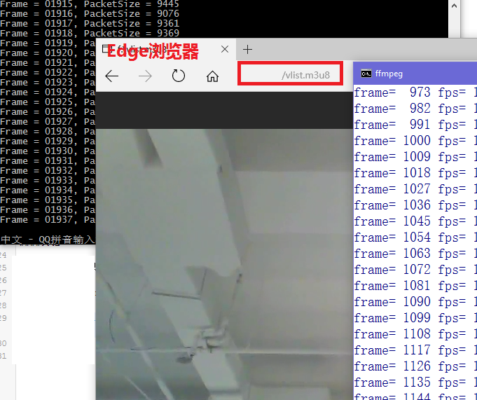

# Stream Publisher
VideoGrab/ScreenCapture & Streaming based on FFmpeg on Windows

------

## 输入方式 ##

1.摄像头

2.屏幕(录屏)

3.*其他（如视频文件输入，未实现）*

## 输出方式 ##

1.推流(RTMP) **需要事先启动NGINX程序**, 另请参阅 [nginx@github](https://github.com/arut/nginx-rtmp-module)

2.保存为视频文件

## 使用示例 ##

    ffStreamPublisher
    ffStreamPublisher rtmp://127.0.0.1/live/stream
    ffStreamPublisher saved_video.mp4

## 播放视频流 ##

1.播放RTMP流，以PotPlayer为例，直接打开rtmp链接即可

2.切割为ts并生成m3u8进行播放，如下

    ffmpeg -hide_banner -i rtmp://127.0.0.1/live/stream -c:v libx264 -f segment -segment_list C:\\fakepath\\vlist.m3u8 -segment_time 10 C:\\fakepath\\slice%d.ts

然后在Edge等浏览器地址栏中输入file:///C:/fakepath/vlist.m3u8即可播放，如下图

